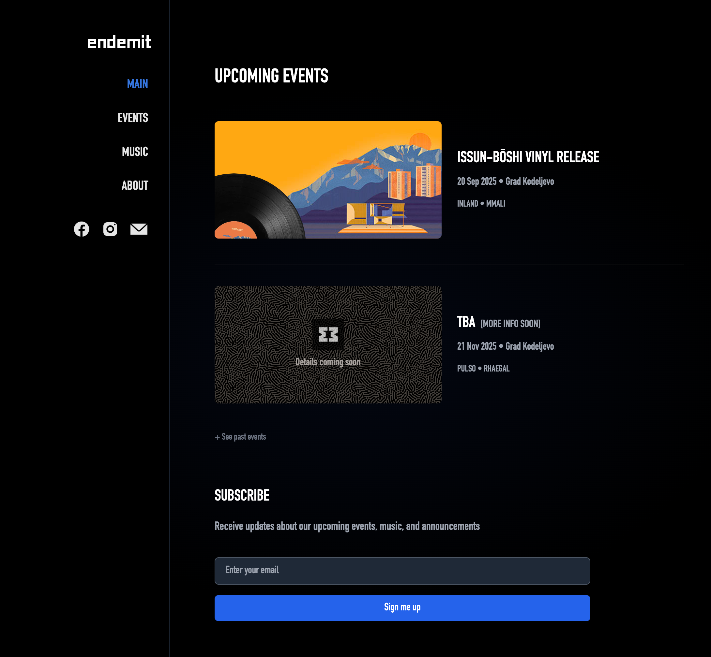

# Endemit web • V3

A modern web application for Endemit events and music curation, built with Next.js 15, React 19, TypeScript, and Tailwind CSS.



## ⭐ Masthead

- 👾 Matic Jurglič [@jurgenwerk](https://github.com/jurgenwerk)
- 👾 Nejc Palir [@n3pal](https://github.com/n3pal)
- 📝 Matej Mirnik
- 📝 Katarina Žniderič
- 🎨 Nejc Dornik
- 🎨 Tija Dolenc Šuštar

## 🧑‍🚀 Quick Start

### Prerequisites

- Node.js 18+
- npm, yarn, or pnpm

### Installation

1. Install dependencies:

```bash
pnpm install
```

2. Run the development server:

```bash
pnpm dev
```

Open [http://127.0.0.1:3000](http://localhost:3000) to view the application.

## 🛠️ Available Scripts

| Script                  | Description                                  |
| ----------------------- | -------------------------------------------- |
| `pnpm run dev`          | Starts the development server with Turbopack |
| `pnpm run build`        | Builds the application for production        |
| `pnpm run start`        | Starts the production server                 |
| `pnpm run lint`         | Runs ESLint to check code quality            |
| `pnpm run format`       | Formats code using Prettier                  |
| `pnpm run format:check` | Checks if code is properly formatted         |

## 🏗️ Build & Deployment

### Development Build

```bash
pnpm run dev
```

### Production Build

```bash
pnpm run build
pnpm run start
```

### Static Export (if needed)

The project is configured for static export. Build artifacts will be in the `.next` directory.

## 🔀 Redirects Configuration

Redirects are configured in `next.config.ts`. Current redirects include:

- `/festival` → `/events/endemit-festival`
- `/endemit-festival` → `/events/endemit-festival`
- `/ius-primae-noctis` → `/events/ius-primae-noctis`
- `/endemit-festival/map` → `/events/endemit-festival/map-and-timetable`

To add new redirects, modify the `redirects()` function in `next.config.ts`:

```typescript
async redirects() {
  return [
    {
      source: '/old-path',
      destination: '/new-path',
      permanent: true, // or false for temporary redirects
    },
  ]
}
```

## 📁 Project Structure

```
endemit-web/
├── public/                 # Static assets
│   ├── endemit-festival/   # Festival images
│   ├── issun-boshi-vinyl-release/ # Album release assets
│   ├── ius-primae-noctis/ # Event assets
│   └── fonts/             # Custom fonts
├── src/
│   └── app/               # Next.js App Router
│       ├── (components)/  # Reusable UI components
│       ├── (content_pages)/ # Main content pages
│       │   ├── about/
│       │   ├── events/
│       │   ├── music/
│       │   ├── merch/
│       │   └── mixes/
│       ├── (styles)/      # Global styles
|       ├── (lib)/       # Utility functions
│       ├── api/           # API routes
│       ├── events/           # event content pages
│       └── layout.tsx     # Root layout
├── next.config.ts         # Next.js configuration
├── tailwind.config.js     # Tailwind CSS configuration
├── tsconfig.json          # TypeScript configuration
└── package.json           # Dependencies and scripts
```

## 🎨 Styling

The project uses **Tailwind CSS**. Each event can have its own color scheme and styling defined.

## 🔧 Key Technologies

- **Framework**: Next.js 15 with App Router
- **Language**: TypeScript
- **Styling**: Tailwind CSS
- **UI**: React 19
- **Analytics**: Vercel Analytics
- **Image Optimization**: Sharp
- **QR Code Generation**: qrcode
- **Parallax Effects**: react-scroll-parallax

## 📱 Features

- Event management and display
- Artist profiles and carousels
- Music and merch sections
- Festival information
- Newsletter subscription
- Responsive design
- Dark theme
- SEO optimization

## 🚀 Deployment

The project is configured for deployment on Vercel with:

- Automatic builds on push
- Image optimization
- Analytics integration
- Static asset serving

## 📄 License

This project is private and proprietary to Endemit.

---

**Built with ❤️ by the Endemit crew**
